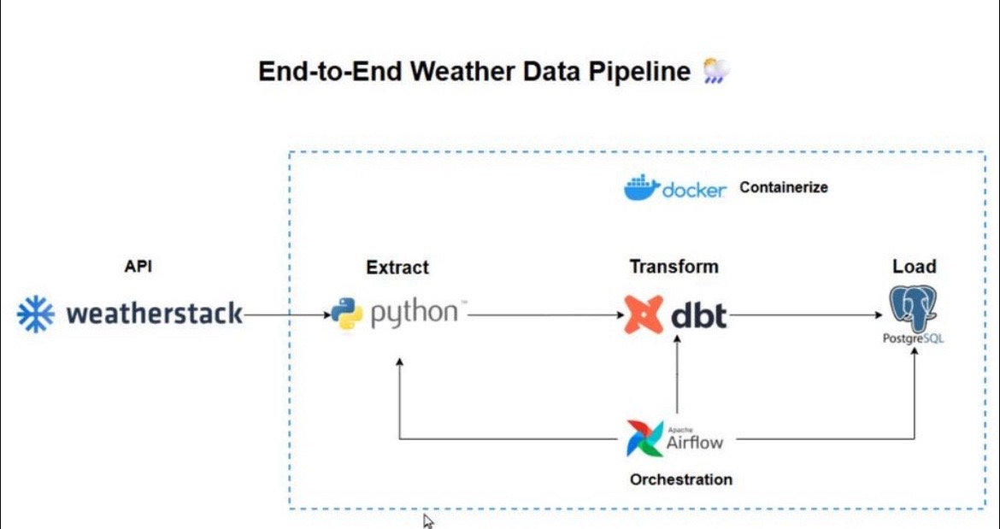

# 🌦️ End-to-End Weather Data Pipeline (Airflow + Postgres + dbt + Docker)

Pipeline **ETL/ELT** conteneurisé qui :
- **extrait** des observations météo depuis l’API *Weatherstack* (Python),
- **charge** les données brutes dans un **PostgreSQL** `warehouse`,
- **transforme** les données avec **dbt** (staging → dimension/fact → métriques),
- est **orchestré** par **Apache Airflow** via **Astro CLI**,
- s’exécute en **Docker** grâce à `docker-compose.override.yml`.



---

## 🧱 Stack
- **Docker / docker-compose** – conteneurisation & réseau local
- **Astro CLI** – Airflow prêt à l’emploi en local
- **Airflow** – orchestration des DAGs
- **PostgreSQL (warehouse)** – stockage des données
- **dbt (core + postgres adapter)** – transformations SQL

---

## 📁 Structure du repo
```
.
├─ dags/
│  ├─ extract_weather.py          # DAG d'extract & load (API → warehouse)
│  ├─ dbt_run.py                  # DAG pour dbt run + test
│  └─ analytics_weather.py        # (optionnel) DAG pour les métriques dbt
├─ weather_dbt/                   # Projet dbt
│  ├─ models/
│  │  ├─ staging/...
│  │  └─ marts/...
│  ├─ dbt_project.yml
│  └─ packages.yml
├─ docker-compose.override.yml    # ajoute le service Postgres warehouse
├─ requirements.txt               # libs Airflow image (dbt, psycopg2…)
├─ Dockerfile                     # image Astro Runtime personnalisée
├─ .env.example                   # variables d'env à copier/adapter
├─ .gitignore
└─ README.md
```

---

## 🔐 Variables d’environnement

Crée un fichier **`.env`** à la racine à partir de **`.env.example`** :

```bash
cp .env.example .env
# puis édite .env (clé API, etc.)
```

Variables utilisées (extrait) :
```dotenv
# Airflow internal Postgres (fourni par Astro)
POSTGRES_USER=postgres
POSTGRES_PASSWORD=postgres
POSTGRES_DB=airflow

# Warehouse Postgres (notre entrepôt)
WAREHOUSE_USER=warehouse
WAREHOUSE_PASSWORD=warehouse
WAREHOUSE_DB=weather
WAREHOUSE_PORT=5433
WAREHOUSE_HOST=warehouse

# API
WEATHERSTACK_API_KEY=CHANGE_ME
```

> ℹ️ **Astro** charge automatiquement `.env` si tu l’indiques avec `--env .env`.

---

## 🐳 Docker & Compose

Le fichier **`docker-compose.override.yml`** (fourni) **ajoute** un conteneur **Postgres 14** pour le *warehouse* et monte le projet dbt dans les conteneurs Airflow.

> Extrait clé :
```yaml
services:
  warehouse:
    image: postgres:14
    env_file:
      - .env
    environment:
      POSTGRES_USER: ${WAREHOUSE_USER}
      POSTGRES_PASSWORD: ${WAREHOUSE_PASSWORD}
      POSTGRES_DB: ${WAREHOUSE_DB}
    ports:
      - "5433:5432"
    volumes:
      - warehouse_data:/var/lib/postgresql/data
```

**Pourquoi 5433 ?** Pour éviter le conflit avec le Postgres interne d’Airflow (5432).

---

## ▶️ Lancer le projet (Astro + Docker)

1) **Installer** prérequis  
- Docker Desktop
- Astro CLI

2) **Construire et démarrer** (en chargeant `.env`) :
```bash
astro dev start --no-cache --wait 180s --env .env
```

3) **URLs**  
- Airflow UI → http://localhost:8080 (admin / admin par défaut)
- Postgres warehouse → `localhost:5433`

4) **Arrêter**  
```bash
astro dev stop
```

---

## 🚀 Exécuter les DAGs

Dans l’UI Airflow :
- **extract_weather** → récupère la météo (Paris) et insère en `raw_weather`.
- **dbt_run** → `dbt run` puis `dbt test` sur le projet `weather_dbt`.
- **analytics_weather** *(optionnel)* → calcule et teste `weather_metrics`.

---

## 🧠 dbt – structure & commandes utiles

Modèles clés :
- `models/staging/stg_weather.sql` – projection/renommage + tests de qualité
- `models/marts/dim_city.sql` – dimension
- `models/marts/fact_weather.sql` – faits par observation
- `models/marts/weather_metrics.sql` – moyennes/jours, anomalies mensuelles, **humidex**

Exécuter dbt **dans le scheduler** :
```bash
docker exec -it $(docker ps -qf "name=scheduler") bash
dbt debug --project-dir /usr/app/weather_dbt --profiles-dir /usr/app
dbt run   --project-dir /usr/app/weather_dbt --profiles-dir /usr/app
dbt test  --project-dir /usr/app/weather_dbt --profiles-dir /usr/app
```

> Dans les DAGs, on passe aussi `--no-write-json --log-format text --log-path /tmp --target-path /tmp/target` pour éviter des problèmes de permissions en écriture.

---

## 🧪 Validation rapide

- `select * from analytics.stg_weather limit 5;`
- `select * from analytics.dim_city limit 5;`
- `select * from analytics.fact_weather limit 5;`
- `select * from analytics.analytics.weather_metrics limit 5;` *(si DAG analytics activé)*

---

## 🛠️ Dépannage (FAQ)

- **Le conteneur `warehouse` boucle au démarrage / demande un mot de passe**  
  ➜ Assure-toi que **`.env`** est chargé par Astro: `astro dev start --env .env`  
  ➜ Vérifie que le volume `warehouse_data` a bien été recréé si tu as changé les secrets.

- **dbt ne se connecte pas**  
  ➜ Dans `profiles.yml` (côté conteneurs Airflow), utilise `host: warehouse` et `port: 5432`.  
  ➜ Depuis l’hôte (tests rapides), utilise `host.docker.internal:5433`.

- **Erreurs de permissions dbt**  
  ➜ Utilise `--no-write-json`, `--log-path /tmp`, `--target-path /tmp/target` (déjà dans les DAGs).

---

## 📜 Licence
Ce dépôt est fourni à titre éducatif et peut être réutilisé/étendu librement dans le cadre de projets d’apprentissage.
